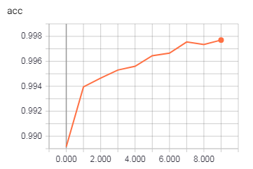

# 机器学习纳米学位
## 毕业项目
辛国茂 优达学城  
2020年5月4日
## 1 问题定义
### 1.1 项目概述
猫狗大战（Dogs Vs. Cats）项本次项目是[Kaggle上的竞赛题目](https://www.kaggle.com/c/dogs-vs-cats-redux-kernels-edition)，目标是训练一个模型从给定的图片中分辨出是猫还是狗，这个是计算机视觉领域的一个问题，也是一个二分类问题。  
项目选择的数据集是Kaggle上竞赛提供的数据，训练集包括12500张被标记为猫和12500标记为猫的图片。测试集是包含12500张未标记的图片。对于每一张测试集中的图像，模型需要预测出是狗图像的概率（1 代表狗，0 代表猫）。

在这个项目中会建立一个神经网络分类器来对猫狗的照片进行分类。
### 1.2 问题陈述
项目需要识别出猫狗，本质上是二分类问题。对应于监督学习就是使用现有的标签的图片训练模型，完成训练后对没有标签的图片进行分类。项目使用深度学习方法识别一张图片是猫还是狗，通过训练模型，任意一张测试的图片，模型将输入数据映射为是猫或者狗的概率。

整个处理过程大概如下:
##### 数据预处理
- 从Kaggle下载图片
- 准备数据，要求猫和狗在不同的文件夹以示分类
- 对图片进行resize，保持输入图片大小一致
- 对训练数据进行随机偏移、转动等变换图像处理，尽可能让训练数据多样化
##### 模型搭建
采用预训练的模型，这些模型可以用来特征提取。
- 使用预训练的模型并去掉全连接层
- 添加自己的全连接层
##### 模型训练&模型调参
- 导入预训练的网络权重
- 冻结除了全连接层的所有层，获得bottleneck特征 
- 尝试使用不同的优化器adam,adadelta等对模型进行训练，选择最佳模型
### 1.3 评价指标
在Kaggle的比赛中提出了标准的评价公式，采用对数损失来衡量，公式如下：

$$ LogLoss = -\frac{1}{n}\sum_{i=1}^n [y_ilog(\hat{y}_i)+(1-y_i)log(1- \hat{y}_i)]$$  
其中：
- $n$ 是图片数量
- $\hat{y}_i$是模型预测为狗的概率
- $y_i$是类别标签，1 对应狗，0 对应猫
- $log()$ 表示自然对数

对数损失越小，代表模型的性能越好。上述评估指标可用于评估该项目的解决方案以及基准模型。项目的要求是 Kaggle Public Leaderboard前10%，也就是在Public Leaderboard上的LogLoss要低于0.06127。
## 2 分析
### 2.1 数据探索与可视化
从Kaggle下载的数据集中包含了两个文件，`train.zip`和`test.zip` 。`train.zip`里面包含了12500猫的照片和12500张狗的照片，每张照片的文件名中都包含有dog或者cat的标签。`test.zip`里有有12500张照片，文件名中没有标签。


上图是训练集的照片，都是日常生活中的随手拍的照片。拍摄方法随意，而且图片的背景非常的生活化。


在训练集中存在比较抽象或者错误的标签照片，对模型会造成一定的干扰。


在测试集中同样会有些效果比较差。如`126.jpg`，没有动物的面部图像，很难直接从照片中看出是猫还是狗，`5292.jpg`和`7999.jpg`都是有网格阻挡，而`5302.jpg`照片中会有一些多余的文字信息。这些会对图像分类器形成一定的挑战。

训练集上图片尺寸分布的散点图如下（横轴为宽度，纵轴为高度）：

可以发现图片尺寸分布不一，训练模型时需要进行resize。

数据集中 `data/train/`里的猫狗图片没有分类，放在一个文件夹，需要将训练照片按照类别文件夹分类，猫和狗的图片放在不同的文件夹中。`train` 里面包含两个文件夹，一个是cat，一个是dog。
``` python 
├── data
│   ├── test [12500张]
│   ├── train [合计20000张]
│   │   ├── cat
│   │   └── dog
│   ├── valid [合计5000张]
│   │   ├── cat
│   │   └── dog
```
### 2.2 算法和技术
#### 2.2.1 深度学习和神经网络简介
**深度学习（Deep Learning）** 是机器学习的分支。深度学习的概念源于人工神经网络的研究，含多隐层的多层感知器就是一种深度学习结构。深度学习通过组合低层特征形成更加抽象的高层表示属性类别或特征，以发现数据的分布式特征表示。  

深度学习的概念由Hinton等人于2006年提出。基于深度置信网络(DBN)提出非监督贪心逐层训练算法，为解决深层结构相关的优化难题带来希望，随后提出多层自动编码器深层结构。此外Lecun等人提出的卷积神经网络是第一个真正多层结构学习算法，它利用空间相对关系减少参数数目以提高训练性能。  

深度学习是机器学习中一种基于对数据进行表征学习的方法。观测值（例如一幅图像）可以使用多种方式来表示，如每个像素强度值的向量，或者更抽象地表示成一系列边、特定形状的区域等。而使用某些特定的表示方法更容易从实例中学习任务（例如人脸识别或面部表情识别）。深度学习的好处是用非监督式或半监督式的特征学习和分层特征提取高效算法来替代手工获取特征。

**人工神经网络（Artificial Neural Network，即ANN ）**，是20世纪80年代以来人工智能领域兴起的研究热点。它从信息处理角度对人脑神经元网络进行抽象，建立某种简单模型，按不同的连接方式组成不同的网络。在工程与学术界也常直接简称为神经网络或类神经网络。神经网络是一种运算模型，由大量的节点（或称神经元）之间相互联接构成。每个节点代表一种特定的输出函数，称为激活函数（activation function）。每两个节点间的连接都代表一个对于通过该连接信号的加权值，称之为权重，这相当于人工神经网络的记忆。网络的输出则依网络的连接方式，权重值和激活函数的不同而不同。而网络自身通常都是对自然界某种算法或者函数的逼近，也可能是对一种逻辑策略的表达。

最近十多年来，人工神经网络的研究工作不断深入，已经取得了很大的进展，其在模式识别、智能机器人、自动控制、预测估计、生物、医学、经济等领域已成功地解决了许多现代计算机难以解决的实际问题，表现出了良好的智能特性。

神经网络是由神经元构成的，神经元的结构如下图，在人工神经网络中也叫做感知机。
<center>
  
</center>
一个感知机包含如下部分：
输入权值（inputs），一个感知机可以接受多个输入$(x_1,x_2,x_3,...,x_n,\forall	 X_{i \in R})$在每个输入上又一个权值$w_{i \in R}$，此外还有一个偏置项 $b \in R$，感知器的激活函数可以有很多选择，比如我们可以选择下面的阶跃函数$f(x)$ 来作为激活函数：
$$f(x) = \begin{cases} 1,x>0 \\ 0,x\leq0 \\  \end{cases} $$
感知机的输出有如下公式来计算：
$$ y=f(w*x+b) $$

深度学习使用的是神经网络模型，神经网络其实是按照一定规则连接起来的多个神经元。
<center>
  
</center>
如上图所示：
- 神经元按照层来布局，最左侧叫输入层（input layer），负责接收输入数据；最右边的层叫输出层（output layer），我们可以从这层获取神经网络的输出数据。输入层和输出层之间的层叫做隐藏层（hidden layer），因为他对外部调用者来说是不可见的
- 同一层之间的不同神经元没有连接
- 第N层每个神经元和低N-1 层所有的神经元相连（Full Connected），第N-1 层神经元的输出就是低N层神经元的额输入
- 每一个连接都有一个权值

#### 2.2.2 卷积神经网络
**卷积神经网络（Convolutional Neural Network, CNN）**是一种前馈神经网络，它的人工神经元可以响应一部分覆盖范围内的周围单元，对于大型图像处理有出色表现。

卷积神经网络由一个或多个卷积层和全连接层（对应经典的神经网络）组成，同时也包括关联权重和池化层。这一结构使得卷积神经网络能够利用输入数据的二维结构。与其他深度学习结构相比，卷积神经网络在图像和语音识别方面能够给出更好的结果。这一模型也可以使用反向传播算法进行训练。相比较其他深度前馈神经网络，卷积神经网络需要考量的参数更少，使之成为一种颇具吸引力的深度学习结构。
<center>
  
</center>

上图以手写字母任务为例
- 网络的输入层是一个32*32的手写数字图像 
- 输出层是其识别结果
- 卷积层和采样层对信号进行处理
- 全连接层实现与输出目标的映射

其中每一个卷积层都包含多个特征映射，每个特征映射是一个由多个神经元构成的“平面”，通过卷积滤波器提取输入的一种特征。采样层又称为池化层，作用是基于局部卷积滤波器原理进行亚采样，在减少数据量的同时保留有用信息。

#### 2.2.3 Xception以及迁移学习
Xception是google在inception之后提出的对inceptionV3的另一种改进，主要采用depthwise separable convolution来替换原来的inception v3中的卷积操作。在与Inception V3参数数量相差无几的情况下，在ImageNet上性能有略微上升，JFT上有明显提高。

Xception主要使用depthwise separable convolution，即将传统的卷积操作分成两步：
- depthwise convolution
  M个的卷积核一对一卷积输入的M个特征图，不求和，生成M个结果。
  <center>
    
  </center>
- pointwise convolution  
  用N个1*1的卷积核正常卷积前面生成的M个结果。
  <center>
    
  </center>
depthwise separable convolution和以上结构的不同之处：
- 操作的顺序不同。depthwise separable conv的实现是先使用channelwise的filter只在spatial dimension上做卷积，再使用1×1的卷积核做跨channel的融合。而Inception中先使用1×1的卷积核。
- 非线性变换的缺席。在Inception中，每个conv操作后面都有ReLU的非线性变换，而depthwise separable conv没有。

Xception结构是将ResNet的相关卷积变成了depthwise separable conv，如下图所示。其中SeparableConv是depthwise separable conv模块。另外，原来的concat变成了residual connection。
<center>
  
</center>

**迁移学习(Transfer learning)** 顾名思义就是就是把已学训练好的模型参数迁移到新的模型来帮助新模型训练。考虑到大部分数据或任务是存在相关性的，所以通过迁移学习我们可以将已经学到的模型参数（也可理解为模型学到的知识）通过某种方式来分享给新模型从而加快并优化模型的学习效率不用像大多数网络那样从零学习（starting from scratch）。世间万事万物皆有共性，如何合理地找寻它们之间的相似性，进而利用这个桥梁来帮助学习新知识，是迁移学习的核心问题。

本项目中使用迁移学习的方法是将冻结除了最后一层全连接层所有网络层的权重。最后一层是一个参数随机初始化的新层，并且只有这一层被训练。当然也可以冻结ResNet网络中的部分网络，比如前130层，对后面的网络结构重新进行训练获取权重。在本项目中，可以使用Keras中预训练好的学习到的网络特征运用在猫狗识别的任务中。

### 2.3 基准模型
依据这个项目的考核标准，需要获得Kaggle比赛前10%的成绩，在[Kaggle的竞赛页面](https://www.kaggle.com/c/dogs-vs-cats-redux-kernels-edition/leaderboard)中，截止目前提交成绩人数为1314名。前10%则意味着分数要超过131名，在页面中可以看到第131名的得分为0.06127，基准模型指标得分需要小于0.06127。

## 3 方法

### 3.1 数据预处理
数据预处理主要有以下的步骤：
- 训练集、验证集拆分
- 训练集和验证集的数据都要拆分成两个文件夹 `dog/`和`cat/`
- 将图片大小resize成299*299
- 标准化，将RGB像素值缩放在0到1的范围内（含0和1）

### 3.2 执行过程
使用了Keras进行建模和预测，后端是基于TensorFlow的。Keras是一个高层神经网络API，Keras由纯Python编写而成并基于Tensorflow、Theano以及CNTK后端。Keras 为支持快速实验而生，有比较好的特性：
- 简易和快速的原型设计（keras具有高度模块化，极简，和可扩充特性）
- 支持CNN和RNN，或二者的结合
- 无缝CPU和GPU切换

主要包含以下几个步骤:
- 构建Xception神经网络
    * 导入没有top层的神经网络模型
    * 为了防止过拟合，添加dropout层，参数设置为0.3
    * 添加输出层
      由于为二分类，选择单节点输出，激活函数为sigmoid
    * 编译模型
- 训练
  optimizer选择adam, adadelta和sgd分别进行实验，从训练过程数据(请见`猫狗大战.html`)来看，这三种优化方法基本在第2轮就能收敛。从Kaggle的评测结果来看，adam效果较好，后续完善部分以adam进行实验。
- 保存最佳模型
- 使用最佳模型进行数据预测

keras.applications.xception.Xception就是本次实验需要使用的预训练模型。这个没有top层的预训练模型是经过了ImageNet的训练，我们需要在实验之前下载好需要模型文件。使用经过了预处理的从Kaggle下载的数据进行了模型的训练，损失函数使用的是交叉熵cross-entropy，并且使用了adadelta,adam,sgd三种优化器对模型进行了训练，并且使用了最佳的模型进行预测。使用了dropout=0.3来防止模型过拟合。提交Kaggle测试结果如下：
| 优化器 | 分数 |
| --- | --- |
|adadelta| 0.08204 |
|adam| 0.06186 |
|sgd| 0.09087 |
另外在输出层之前加入一个中间层节点数为256，dropout=0.3，看增加模型的复杂度，会不会提升效果。如下：
```python
base_model = Xception(
  input_tensor=Input((target_image_size[0], target_image_size[1], 3)),
  weights='imagenet', include_top=False)
# 冻结base_model中所有的层
for layers in base_model.layers:
    layers.trainable = False

# 基于base_model定义模型
x = GlobalAveragePooling2D()(base_model.output)
x = Dropout(0.3)(x)
x = Dense(256, activation='relu')(x)
x = Dropout(0.3)(x)
x = Dense(1, activation='sigmoid')(x)
model = Model(base_model.input, x)
```
从验证集acc和loss来看，没有明显改善，提交Kaggle进行测试，得分为`0.06836`，没有变好。可能因为猫狗分类这种二分类问题比较简单，复杂的模型容易产生过拟合。

具体请见`猫狗大战.ipynb`的`2 执行过程`部分。

### 4 完善
经过以上方法多次尝试后结果如下（选取部分结果）:
| 优化器 | 分数 |
| --- | --- |
|adadelta| 0.08204 |
|adam| 0.06186 |
|sgd| 0.09087 |
经过多次且长时间探索尝试，训练出来的最佳模型预测的结果均不能满足`基准模型指标得分需要小于0.06127`的要求。经过网上调研分析，发现问题出在BN层，具体如下：
- TF为后端时，BN有一个参数是training，控制归一化时用的是当前Batch的均值和方差（训练模式）还是移动均值和方差（测试模式），这个参数由Keras的K.learning_phase控制。但是只设置trainable是不会影响BN的training参数
- 冻结时某一层时，我们希望这一层的状态和预训练模型中的状态一致
- 我们通常希望训练和测试时网络中的配置一致，但BN训练和测试时的配置是不一样的，而frozen这个行为放大了这种不一致，导致精度下降。训练时用了新数据集的均值和方差去做归一化，测试时用了旧数据集的移动均值和方差去做归一化

需要在训练时也只用旧数据集的移动均值和方差，这是Keras作者fchollet在[GitHub issue里回复的方案](https://github.com/keras-team/keras/pull/9965#issuecomment-382801648)，通过设置learning_phase，如下：
```python
import keras.backend as K
K.set_learning_phase(0)
```
同时试验dropout为[0, 0.1, 0.2, 0.3]，用3.2中同样的步骤进行训练，并选择最优模型生成测试集结果提交给Kaggle进行打分，具体请见`猫狗大战.ipynb`的`3 完善`部分。结果如下：
| dropout | 分数 |
| --- | --- |
|no| 0.04552 |
|0.1| **0.04375** |
|0.2| 0.04459 |
|0.3| 0.04520 |
都能满足要求，并且dropout为0.1时的模型最好，下面的部分以此模型进行分析。

## 5 结果

### 5.1 模型的评价与验证
使用keras.callbacks.TensorBoard对训练过程记录日志，并且使用Tensorboard对数据进行可视化效果如下。
**优化之前**
|  | |
| :---: | :---: |
| 训练精度 | 训练损失 |
|  |  |
| 验证精度 | 验证损失 |
经过10轮的训练，在验证集上的准确度在97%-98.5%这个区间，有所波动。
**优化之后**
|  | |
| :---: | :---: |
| 训练精度 | 训练损失 |
|  |  |
| 验证精度 | 验证损失 |
从图中可以看到，使用优化后的方法相比优化前在验证集上的准确度高很多，10轮训练稳定在99.4%左右。可以看到在10轮的训练中，训练集上准确度在不断的增加，验证集上准确度相对稳定。优化有的方法效果较好，并且训练的轮数较少时就能达到不不错的效果。
将生成的文件提交到Kaggle，得分为0.04375，满足了项目要求的kaggle比赛前10%的成绩的得分为不高于0.06127。

### 5.2 合理性分析
在Keras 2.1.3及之后，当BN层被设为trainable=False时，测试时使用的是预训练模型中的移动均值和方差，从而达到冻结的效果，但是训练时仍然使用当前Batch计算均值和方差进行归一化，这对于迁移学习来说有问题的。当Keras中BN层冻结时，在训练中会用mini batch的均值和方差统计值以执行归一化，更好的方式应该是使用预训练模型中的移动均值和方差。上面的实验也证明了这一点。

## 6 项目结论

### 6.1 结果可视化
下图是用优化之后模型进进行预测的结果展示,可以看到都是正确的结果，精确度也比较高。


### 6.2 对项目的思考
本次实验一开始使用经过Imagenet训练过的神经网络是正确的选择，但是刚开始缺乏对Keras关于BN层的冻结处理理解不深，经过多次训练都没有办法达到项目的要求。不过通过网上查找相关问题，找到了原因，进行了优化，比较轻松就能满足项目的需求。通过这次实验也了解到，使用迁移学习解决这样类似的图片分类问题是非常明智的选择，Keras非常快的提高了开发和验证探索的可能性。

### 6.3 需要作出的改进
- 项目中只使用的单个全连接层，可以尝试多层看是否能提高效果
- 针对其他的预训练模型（比如InceptionV3, InceptionResNetV2等）可以进行尝试看一下效果
- 针对多种模型的组合，比如联合Resnet50, InceptionV3和Xception的预训练模型生成的特征组合起来作为输入，可能也是值得尝试的。

## 7 参考文献
[1] Francois Chollet, Xception: Deep Learning with Depthwise Separable Convolutions ( arXiv:1610.02357v3 )
[2] [Keras的BN你真的冻结对了吗？](https://zhuanlan.zhihu.com/p/56225304)
[3] [Change BN layer to use moving mean/var if frozen](https://github.com/keras-team/keras/pull/9965#issuecomment-382801648)